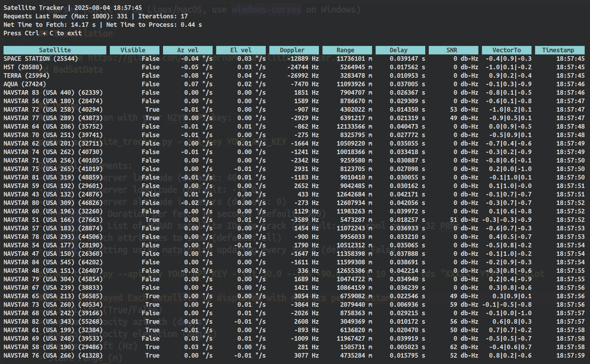
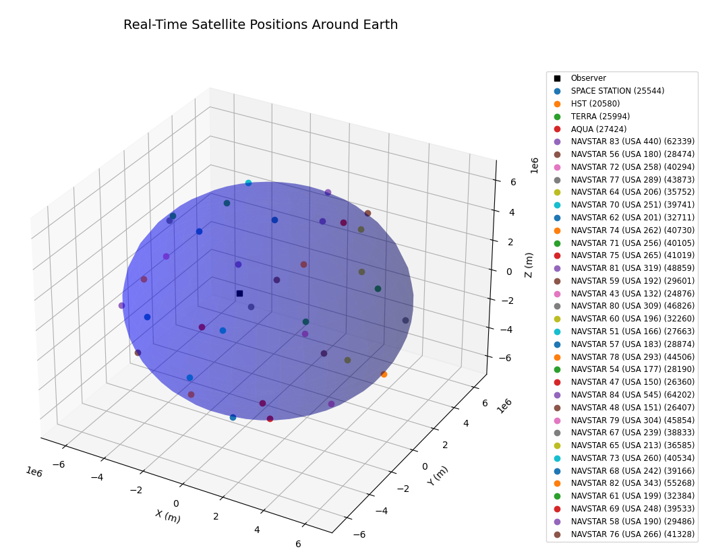

# Satellite Tracker 

## Overview Satellite 
Tracker retrieves real-time satellite positional data from the N2YO API, processes it to compute various metrics, and displays the results in a curses-based terminal UI. It supports continuous updates, interactive scrolling, and multi-satellite tracking. Kinda bad though




## Features 
- Fetch and process satellite data concurrently. 
- Calculate metrics including angular velocities, Doppler shift, slant range, visibility, and SNR. 
- Plots cool stuff.
- Display data in a scrollable curses interface. 
- Configurable observer location and satellite list. 
- Logs data and output for diagnostics. 

## Requirements 
- Python 3.7+ 
- requests library 
- curses (built-in on Linux/macOS, use `windows-curses` on Windows) 

## Installation 

```
git clone https://github.com/yourusername/satellite-tracker.git
cd BadSatData
```


## Usage 
Run the program with your N2YO API key: 

```
python main.py --api_key YOUR_API_KEY
``` 

Optional arguments: 
- `--lat` : Observer latitude (default: 40.0) 
- `--lon` : Observer longitude (default: -74.0) 
- `--alt` : Observer altitude in meters (default: 0)
- `--seconds` : Duration per fetch in seconds (default: 300) 
- `--sat_ids` : List of NORAD satellite IDs to track (default: some cool ones + 32 PRNs)
- `--show`: Which attributes to show (default: all)
- `--plot`: Plotting using matplotlib updating every 300 s (default: False)

```
python main.py --api_key YOUR_API_KEY --lat 30.0 --lon -90.0 --alt 10 --sat_ids "XXXXX, YYYYY" --plot
```

## Data Displayed Each satellite is displayed with metrics per timestamp: 
- Visibility (True/False)
- Angular velocity azimuth (deg/s)
- Angular velocity elevation (deg/s)
- Doppler shift (Hz)
- Slant range (m)
- Signal time delay (s)
- Signal-to-noise ratio (dB-Hz)
- Unit vector components (X|Y|Z)
- Timestamp (HH:MM:SS)

## Controls 
- Arrow keys: Scroll horizontally and vertically.
- Ctrl+C: Exit program. 

## Notes 
- The program continuously updates and maintains up to the specified seconds of data.
- Metrics calculation accounts for observer location and satellite movement.
- Logging occurs in a timestamped file under a `logs` directory, same for data (`data` directory). 

## License 
MIT License


